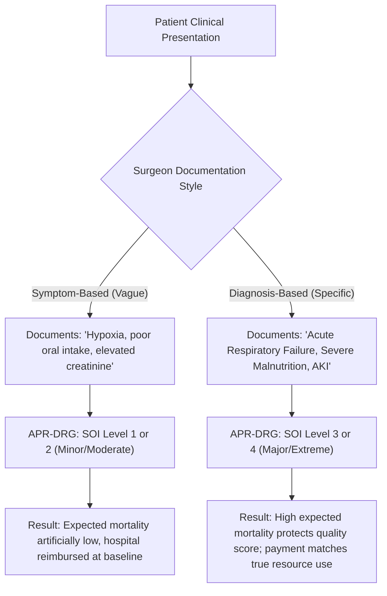

# APR-DRG Version 42 Severity & Mortality Comparison Guide (FY 2025)
## Bridging the Documentation Gap for Colorectal and Spine Surgeons

This guide explains how to find the **All Patient Refined Diagnosis Related Group (APR-DRG)** tables for FY 2025 (Version 42) and how to leverage them to engage Colorectal (Major Bowel) and Spine surgeons. 

By demonstrating the mathematical and clinical impact of documentation on a patient's **Severity of Illness (SOI)** and **Risk of Mortality (ROM)** subclasses, clinical documentation improvement (CDI) leaders can align clinical reality with reported acuity.

---

## 1. Executive Comparison: MS-DRG vs. APR-DRG

To communicate effectively with surgeons, it is vital to understand the difference between the two primary DRG systems used in U.S. hospitals:

*   **MS-DRG (Medicare Severity DRG):** 
    *   *Used by:* Medicare (CMS) and models like **TEAM (Transforming Episode Accountability Model)**.
    *   *Structure:* Splits certain base DRG families into 2 or 3 severity tiers based on the presence of Complications or Comorbidities (CC) or Major Complications or Comorbidities (MCC). 
    *   *Limitation:* Many DRG families do not have a CC/MCC split. For those that do, a single secondary diagnosis of a CC or MCC shifts the entire case to a higher-paying tier, regardless of how many other conditions the patient has.
*   **APR-DRG (All Patient Refined DRG):**
    *   *Used by:* State Medicaid programs and commercial payers (developed and maintained by 3M/Solventum).
    *   *Structure:* Every single base APR-DRG has **four distinct subclasses** for both **Severity of Illness (SOI)** and **Risk of Mortality (ROM)**:
        1.  **1 = Minor**
        2.  **2 = Moderate**
        3.  **3 = Major**
        4.  **4 = Extreme**
    *   *Clinical Logic:* The SOI and ROM levels are calculated based on the interaction of all secondary diagnoses, age, procedures, and principal diagnosis. Surgeons find this system more intuitive because it reflects a complete clinical picture rather than a single CC/MCC trigger.

---

## 2. Where to Access the 2025 APR-DRG (Version 42) Tables

Because APR-DRG is a proprietary classification system owned by **Solventum (formerly 3M Health Information Systems)**, the federal government does not publish a free, universal master table. However, since many state Medicaid programs utilize the system, they publish version-specific relative weight tables in spreadsheet format:

### Public Sources for Excel/CSV Weight Tables:
1.  **Colorado Department of Health Care Policy and Financing (HCPF):**
    *   Maintains the [Colorado HCPF Inpatient Hospital Payment Portal](https://hcpf.colorado.gov/inpatient-hospital-payment).
    *   Provides direct Excel downloads of the **APR-DRG Version 42 Relative Weight Table** containing weights, ALOS, and outlier thresholds for all 16 SOI/ROM combinations per base DRG.
2.  **Indiana Health Coverage Programs (IHCP):**
    *   Published [IHCP Provider Bulletins](https://www.in.gov/medicaid/providers/) (e.g., Bulletin BT202598), which include Table 2 containing the full set of relative weights and ALOS for APR-DRG v42.
3.  **Pennsylvania Department of Human Services:**
    *   Hosts the [PA DHS Inpatient Rates and DRG Weights](https://www.dhs.pa.gov/) page, detailing the fee-for-service relative values for the state's APR-DRG v42 implementation.
4.  **Internal Hospital Resources:**
    *   If your hospital holds a 3M APR-DRG grouper license, the hospital's **CDI Director, Coding Manager, or Decision Support Team** can download the official national v42 Excel tables directly from the **Solventum Grouper Plus Content Services (GPCS)** portal.

> [!IMPORTANT]
> **State-Specific Normalization:**
> While the base APR-DRG grouping logic is identical across payers, states apply a "normalization factor" to relative weights to balance their Medicaid budgets. For clinical documentation education, any of these state tables (such as Colorado or Indiana) can be used to show surgeons the relative scale and ratio of weights, but you must use the local contract weight for precise financial modeling.

---

## 3. The Acuity & Reimbursement Impact: Spine & Colorectal DRGs

Below is the clinical and financial data for Colorectal and Spine surgeries using the **APR-DRG Version 42** framework. 

### 🧫 A. Colorectal Surgeons: APR-DRG 221 (Major Small & Large Bowel Procedures)
Under APR-DRG, colorectal procedures map to base DRG 221. Note how the relative weight climbs as documentation moves from "Minor" to "Extreme" severity:

| Severity of Illness (SOI) | Relative Weight (v42)* | Increase vs. Base (SOI 1) | Expected Resource & Intensity |
| :--- | :---: | :---: | :--- |
| **Level 1 (Minor)** | **1.4866** | — | Uncomplicated bowel resection; healthy patient. |
| **Level 2 (Moderate)** | **1.8827** | **+27%** | Minor complications or stable baseline chronic diseases. |
| **Level 3 (Major)** | **3.1014** | **+109%** | Severe malnutrition, acute kidney injury (AKI), or controlled peritonitis. |
| **Level 4 (Extreme)** | **6.6083** | **+344%** | Sepsis with septic shock, acute respiratory failure on ventilator, post-op shock. |

*\*Illustrative weights based on v42 base standard schedules. Direct payments scale proportionally.*

### 🧠 B. Spine Surgeons: APR-DRG 304 (Dorsal & Lumbar Fusion Procedures Except Curvature)
Spine fusions map to base DRG 304. Spine procedures are highly elective, and surgeons often fail to document the severe chronic pain and dependency issues that their patients present with:

| Severity of Illness (SOI) | Relative Weight (v42)* | Increase vs. Base (SOI 1) | Expected Resource & Intensity |
| :--- | :---: | :---: | :--- |
| **Level 1 (Minor)** | **2.5570** | — | Single-level fusion; patient walks out in 1–2 days. |
| **Level 2 (Moderate)** | **3.4838** | **+36%** | Patient with controlled hypertension, diabetes, or mild post-op posthemorrhagic anemia. |
| **Level 3 (Major)** | **4.8493** | **+90%** | Multilevel fusion with active opioid dependence, tobacco use disorder, or severe osteomyelitis. |
| **Level 4 (Extreme)** | **6.5781** | **+157%** | Major neurological deficit (paraplegia), post-op hemorrhage requiring return to OR, or septicemia. |

---

## 4. The Surgeon Documentation Gap: A Clinical Example

Surgeons tend to document clinical complications as **symptoms or parameters** rather than **diagnostic conclusions**. This creates a significant gap between how sick the patient actually was and how "healthy" they appear to the DRG grouper:

### The Clinical Translation Table
Use this table to show surgeons how their daily charting directly dictates the patient's SOI and ROM tier:

| Clinical Scenario | Insufficient Documentation (SOI 1/2) | Query-Compliant Documentation (SOI 3/4) | SOI Impact | ROM Impact |
| :--- | :--- | :--- | :---: | :---: |
| **Bowel Obstruction / Cancer Cachexia** | "Poor oral intake" / "Thin" / "Low albumin" | **Severe Protein-Calorie Malnutrition (E43)** | **1 ➔ 3** | **1 ➔ 3** |
| **Post-operative Hypoxia** | "Hypoxia, placed on 2L nasal cannula" | **Acute Respiratory Failure with Hypoxia (J96.01)** | **2 ➔ 3** | **1 ➔ 3** |
| **Anastomotic Leak / Peritonitis** | "Bowel leak, returned to OR for wash-out" | **Acute Peritonitis (K65.0)** + **Sepsis (A41.9)** | **2 ➔ 4** | **2 ➔ 4** |
| **Contrast or Pump-Induced Kidney Injury** | "Cr rose to 2.4, fluids ordered" | **Acute Kidney Injury (AKI) (N17.9)** | **1 ➔ 3** | **1 ➔ 2** |
| **Chronic Pain / Long-term Opioid Use** | "Taking Percocet at home for years" | **Opioid Dependence, Uncomplicated (F11.20)** | **1 ➔ 3** | **1 ➔ 1** |

---

## 5. Engagement Strategy: How to "Move Surgeons' Hearts"

Surgeons are competitive, data-driven, and highly protective of their professional reputations. To motivate them to improve their clinical documentation, deploy the following three strategies:

### 📊 1. The Quality Profile Shield (Defending Their Reputation)
Surgeons care deeply about public quality rankings (e.g., Leapfrog, Healthgrades, CareChex). 
*   **The Argument:** "If you do not document that your bowel resection patient has *severe malnutrition* and *active COPD*, their risk-adjusted Expected Mortality rate is calculated as near-zero. If that patient suffers a sudden cardiac arrest and expires post-operatively, CMS views it as an *unexpected death on a healthy patient*. This counts heavily against your personal Risk-Standardized Mortality Rate (RSMR)."
*   **The Pitch:** "Specific documentation doesn't just increase payment; it acts as a shield to protect your quality profile by showing CMS exactly how sick your patients truly were before surgery."

### 📈 2. The Peer Comparison Benchmark
Show them how their comorbidity capture rates compare to regional and national peers. 
*   As noted in Huntsville Hospital's [TEAM Regional Analysis](file:///Users/uxorious/Projects/TEAM-CDI-Content-Creation/CC-MCC-Analysis/reports/TEAM-Capture-Rate-Regional-Analysis.md), Huntsville's Spine Fusion cases are billed in the lowest-acuity "None" tier **56.99%** of the time, compared to only **24.62%** nationally. 
*   Huntsville captured **0.00%** MCCs for Spine Fusion, while national peers captured them on **3.06%** of cases.
*   **The Pitch:** "Our patients aren't healthier than the rest of the country. We are simply failing to tell their story. This under-documentation makes our surgical outcomes look worse because our expected complications are set too low."

### 💸 3. Quantify the Operational Loss
Show them the gap in hospital resources.
*   As detailed in the [Morbid Obesity Impact Analysis](file:///Users/uxorious/Projects/TEAM-CDI-Content-Creation/CC-MCC-Analysis/reports/Morbid-Obesity-Documentation-and-DRG-Impact.md), failing to document a patient's morbid obesity (or linking a BMI of 35-39 to osteoarthritis) loses **+$10,660.50** on a spinal fusion case and **+$5,345.25** on a major bowel procedure.
*   **The Pitch:** "Every undocumented comorbidity represents lost resources that could have funded specialized nursing staff, advanced surgical instruments, or post-operative recovery equipment for your patients."
