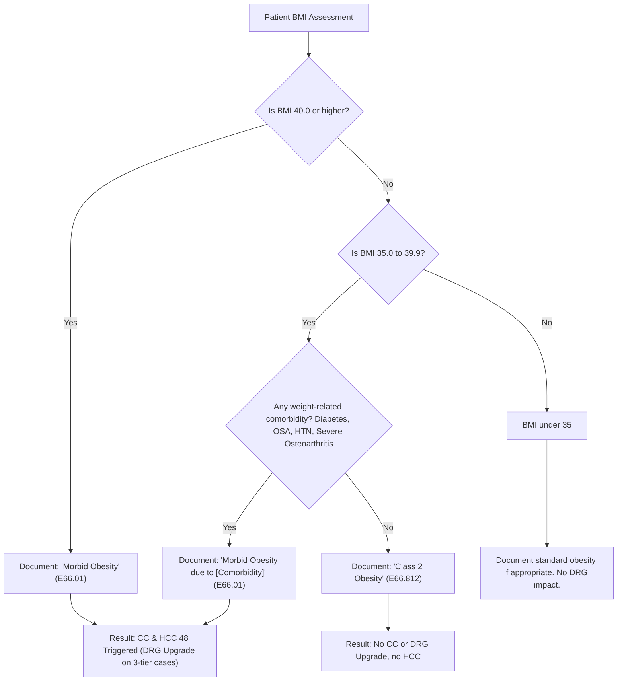

# Clinical Documentation Improvement (CDI) Guide: Morbid Obesity
## MS-DRG Severity & HCC 48 Risk-Adjustment Analysis for the 5 TEAM Procedures

This report details how documenting and coding **morbid obesity** affects hospital reimbursement under the Medicare Severity Diagnosis Related Group (MS-DRG) system and how it influences quality and cost benchmarks under the CMS Transforming Episode-Based Payment (TEAM) model.

---

## 1. Executive Summary: The Clinical Coding Logic

Morbid obesity represents significant patient complexity. However, its impact on inpatient billing and risk adjustment is governed by distinct rules:

1. **The DRG Impact (CC Status):** In the MS-DRG system, the diagnosis of **Morbid Obesity (E66.01 or E66.813)** or a **BMI of 40.0 or greater (Z68.41–Z68.45)** acts as a **Complication or Comorbidity (CC)**. It is NOT a Major Complication or Comorbidity (MCC).
2. **The Risk-Adjustment Impact (HCC 48):** For all 5 TEAM procedures, morbid obesity is tracked as **HCC 48 (Morbid Obesity)**. HCC 48 adjusts CMS quality expectations (e.g., expected complications, mortality, and readmissions) and raises the target budget/benchmark for the episode.

> [!IMPORTANT]
> **Documentation Rule for Coding:**
> BMI codes (Z68.xx) cannot be reported as standalone codes and do not act as CCs in isolation. To capture a high-BMI code as a CC, the provider must explicitly document a weight-related diagnosis like **morbid obesity** or **severe obesity** in the progress notes or discharge summary. While BMI can be pulled from nursing/dietitian notes, the diagnosis itself must come from a provider.

---

## 2. DRG and Financial Impact across the 5 TEAM Procedures

How a CC (like morbid obesity) changes the DRG depends on whether the procedure family uses a **2-tier** or **3-tier** MS-DRG structure:

| TEAM Procedure Family | MS-DRG Tiers | Morbid Obesity (CC) Impact on DRG | Weight Shift (FY 2025) | Financial Impact (Estimated)* |
| :--- | :---: | :--- | :---: | :---: |
| **🦴 1. LEJR** *(Joint)* | 2-Tier *(w/ MCC vs. w/o MCC)* | **No DRG Shift.** CCs do not upgrade the payment tier from DRG 470/522. | None | $0 (Direct Reimbursement) |
| **🦿 2. SHFFT** *(Fracture)* | 3-Tier *(MCC / CC / None)* | **Upgrades DRG 482 (w/o CC/MCC) to DRG 481 (w/ CC).** | **1.5864 ➔ 2.0749** *(+0.4885)* | **+$3,663.75** per case |
| **❤️ 3. CABG** *(Bypass)* | 2-Tier *(w/ MCC vs. w/o MCC)* | **No DRG Shift.** CCs do not upgrade the payment tier from DRG 232/234/236. | None | $0 (Direct Reimbursement) |
| **🧫 4. Major Bowel** *(Bowel)* | 3-Tier *(MCC / CC / None)* | **Upgrades DRG 331 (w/o CC/MCC) to DRG 330 (w/ CC).** | **1.6510 ➔ 2.3637** *(+0.7127)* | **+$5,345.25** per case |
| **🧠 5. Spinal Fusion** *(Spine)* | 3-Tier *(MCC / CC / None)* | **Upgrades DRG 458 (w/o CC/MCC) to DRG 457 (w/ CC)** *or* **DRG 428 to DRG 427.** | **4.3180 ➔ 5.7394** *(+1.4214)* | **+$10,660.50** per case |

*\*Based on an illustrative Medicare Base Payment Rate of $7,500. Actual payment varies by hospital wage index and characteristics.*

---

## 3. The Quality & Benchmarking Impact (HCC 48)

As verified in the project's [HCC-by-Procedure-Single-Sheet -.csv](file:///Users/uxorious/Projects/TEAM-CDI-Content-Creation/CC-MCC-Analysis/data/HCC-by-Procedure-Single-Sheet%20-.csv), **HCC 48 (Morbid Obesity)** is associated with **all 5 TEAM procedures**. 

Even for 2-tier families like **LEJR** and **CABG** where morbid obesity does not change the direct inpatient MS-DRG payment, documenting it is clinically vital for quality reporting:

* **Saves Quality Ratings:** Obese patients face significantly higher risks of surgical site infections, pulmonary complications, wound dehiscence, and readmissions. By documenting morbid obesity, the hospital assigns **HCC 48** to the case. CMS risk-adjustment algorithms then increase the "expected" complication and readmission rates for these cases. This prevents the hospital's quality scorecard from being penalized when complications occur in high-risk patients.
* **Raises Episode Spending Target:** Under TEAM's bundled payment model, hospitals are compared against a target price. A patient with HCC 48 is recognized as consuming more resources (e.g., operating room time, specialized beds, longer recovery). CMS adjusts the target price upward for patients with HCC 48, giving the hospital a more realistic and higher budget to care for the patient.

### **The Obesity Classes by BMI (CDC & WHO Definitions)**
* **Class 1 (Low-Risk Obesity):** BMI of **30.0 to 34.9** (Coded as `E66.811` with `Z68.30`–`Z68.34`). This is a **Non-CC** and does not risk-adjust to HCC.
* **Class 2 (Moderate-Risk Obesity):** BMI of **35.0 to 39.9** (Coded as `E66.812` with `Z68.35`–`Z68.39`). On its own, this is a **Non-CC** and does not risk-adjust. 
  * *Clinical Exception:* If a Class 2 patient has significant obesity-related comorbidities (e.g., severe sleep apnea, type 2 diabetes, or severe osteoarthritis), the provider should diagnose **Morbid Obesity (E66.01)**. This shifts the case to a **CC** and triggers **HCC 48**.
* **Class 3 (Severe / Morbid Obesity):** BMI of **40.0 or higher** (Coded as `E66.813` or `E66.01` with `Z68.41`–`Z68.45`). This automatically functions as a **CC** and triggers **HCC 48**.

> [!WARNING]
> **New Class 1 and Class 2 Obesity Codes (FY 2025):**
> Effective October 1, 2024, CMS introduced new codes for Class 1 Obesity (`E66.811`) and Class 2 Obesity (`E66.812`). These codes **do not carry CC status** and **do not risk-adjust** to HCC 48. Documentation of standard "obesity" or "Class 1/2 obesity" without associated comorbidities will not improve reimbursement or risk-adjust quality metrics.

---

## 4. Surgeon Documentation Reference Card

Use this table to train surgeons on the specific language required to document patient acuity:

| Insufficient Documentation | Clinical Indicator | Required Provider Documentation | Coding Result | Severity/Risk Impact |
| :--- | :--- | :--- | :---: | :---: |
| "Obese" or "Overweight" | BMI 42.1 | **"Morbid Obesity due to excess calories (E66.01)"** + **"BMI 42.1 (Z68.41)"** | **CC** | Upgrades 3-tier DRGs & triggers **HCC 48** |
| "Obesity" or "BMI 37" | BMI 37.4, Patient has severe osteoarthritis and diabetes | **"Morbid Obesity due to comorbidities (E66.01)"** + **"BMI 37.4 (Z68.37)"** | **CC** | Upgrades 3-tier DRGs & triggers **HCC 48** |
| "Obese" | BMI 36.2, No comorbidities | **"Obesity, Class 2 (E66.812)"** + **"BMI 36.2 (Z68.36)"** | **Non-CC** | No DRG shift, no HCC risk-adjustment |

### **Clinical Criteria to Support "Morbid Obesity"**
A surgeon can diagnose and document "Morbid Obesity" (or "Severe Obesity") if the patient meets either of the following criteria:
1. **BMI of 40 or greater** (no comorbidities required).
2. **BMI of 35.0 to 39.9 with at least one obesity-related comorbidity** (e.g., obstructive sleep apnea, type 2 diabetes, hypertension, hyperlipidemia, coronary artery disease, or severe osteoarthritis impacting joints).

---

## 5. Surgeon Clinical Advice: When & How to Think About Obesity

### **When to Think About Obesity in the Surgical Workflow**
1. **Pre-operative H&P (Admission / Pre-admission):**
   * **Identify early:** Check height, weight, and BMI on the patient's chart. If the BMI is **$\ge 35$**, obesity should immediately enter the clinical decision-making process and documentation.
   * **Assess risk factors:** Check if the patient has comorbidities that are exacerbated by weight (diabetes, OSA, severe osteoarthritis of the hip/knee/spine).
2. **Operative Notes & Intraoperative Planning:**
   * **Resource deployment:** If the patient's size required extra equipment (e.g., heavy-duty surgical table, specialized retractors, bariatric-length instruments, or extra assistants for positioning), document these resources. 
   * **Anesthesia adjustments:** Mention any custom anesthesia considerations due to obesity (e.g., airway difficulty, altered drug dosing).
3. **Post-operative Care & Orders:**
   * **Clinical management:** Document active interventions related to obesity management, such as customized mobilization protocols, bariatric hospital beds, specialized skin assessments (to prevent pressure ulcers in skin folds), or extra monitoring for respiratory status (e.g., CPAP/BiPAP for sleep apnea).

---

### **Surgeon's BMI Decision Tree for CC/HCC Upgrades**

> [!TIP]
> **Surgeon Cheat Sheet for Progress Notes:**
> * **DO NOT** simply write "Obese" or copy the raw BMI number into your assessment plan.
> * **DO** write: **"Morbid obesity"** when the patient's BMI is $\ge 40$.
> * **DO** write: **"Morbid obesity due to [comorbidity]"** when the patient's BMI is 35.0–39.9 and they have an active comorbidity like sleep apnea or diabetes.
> * **DO** link the diagnosis to patient care: *"Patient's morbid obesity requires specialized post-op mobilization planning and respiratory monitoring."*

